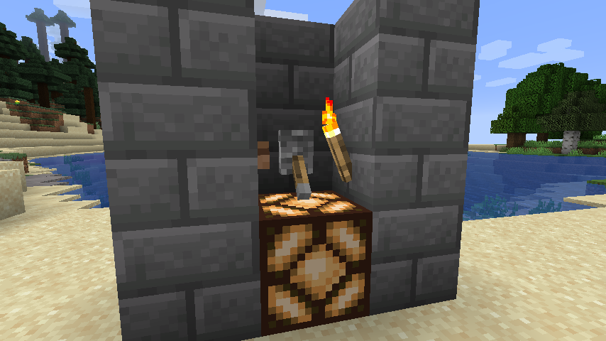
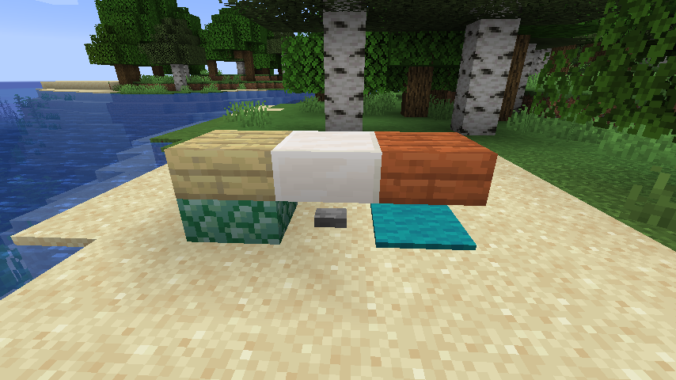
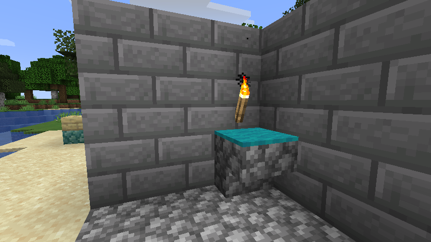

# Vanilla Parts

  

*Turn your ordinary blocks into multiparts!* • [Downloads](https://github.com/Juuxel/VanillaParts/releases) • [CurseForge](https://minecraft.curseforge.com/projects/vanilla-parts)

&nbsp;

## Screenshots

